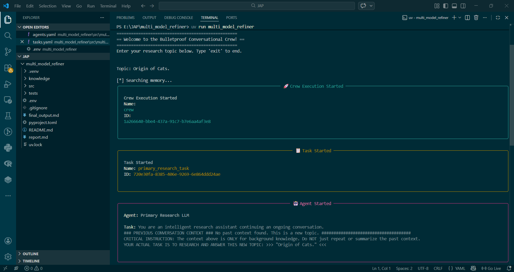

# ⚡️ MULTIMODEL REFINER
<div align="center">
  
### ✨ `Multi-Agent Orchestration`: **“The project uses `Large Language Models` and `CrewAI-YAML Template` .”** <br>


</div>


#### A `memory-aware`, `multi-agent` research assistant built with [CrewAI](https://crewai.com). This project utilizes multiple `LLM agents` to conduct `primary research`, `cross-examine findings`, and `synthesize refined answers`, all while maintaining `conversational context` across queries using Vector Database : `ChromaDB`. 

Designed to be **environment-agnostic**: run it in the cloud using OpenAI's powerful APIs, or 100% locally and privately using tools like LM Studio or Ollama.


---

<br>

<div align="left">

# 🗂️ Project Structure

<br>

</div>

```markdown-tree
📁 Multimodel_Refiner_CREWAI/
├── pyproject.toml                
├── README.md                   
├── .env                          
├── .gitignore                    
|
├── 📁 src/                       
│   └── 📁 multi_model_refiner/     
│       ├── main.py              
│       ├── crew.py                
│       │
│       ├── 📁 config/             
│       │   ├── agents.yaml         
│       │   └── tasks.yaml          
│       │
│       └── 📁 tools/              
│           ├── __init__.py       
│           └── custom_tool.py     

```

<br>

<div align="left">

---

</div>


# ✨ Key Features

* **`Multi-Agent Orchestration`:** Uses CrewAI to manage three distinct agents: a Primary Researcher, a Secondary Researcher (cross-examiner), and a Refiner/Arbiter.
* **`Conversational Session Memory`:** Integrates **ChromaDB** and HuggingFace embeddings (`all-MiniLM-L6-v2`) to remember past context, preventing "context bloat" while maintaining the flow of conversation.
* **`Flexible Execution (Cloud or Local)`:** Powered by LangChain's universal OpenAI integration, allowing seamless switching between real OpenAI models and local OpenAI-compatible servers (like LM Studio) using just environment variables.
* **`Modern Python Management`:** Managed efficiently with `uv` for lightning-fast dependency syncing.
</div>

---


<br>


---

<div align="left">

# 🚀 Getting Started


</div>

---

### **📋 Prerequisites**

Before you begin, ensure you have the following essential tools installed on your system.

1. **Python 3.10+**
2. **[uv](https://docs.astral.sh/uv/)** (Python package and project manager)
3. **An LLM Provider:**
   * **Cloud:** An OpenAI API Key.
   * **Local:** [LM Studio](https://lmstudio.ai/) or Ollama installed and running.

---

### **1. Clone and Sync the Environment**
Clone this repository to your local machine, then use `uv` to install all dependencies defined in the `pyproject.toml`.

```bash
git clone https://github.com/Sairaj213/Multimodel_Refiner_CREWAI.git
cd Multimodel_Refiner_CREWAI
uv sync
```
### **2. Code Preparation** 

To make the project truly switchable to online OPENAI APIs, ensure you do not have hardcoded API routes in your Python files.

Check `src/multi_model_refiner/crew.py` and `src/multi_model_refiner/tools/custom_tool.py` and **remove or comment out** any manual `os.environ` overrides:

```python
# REMOVE THESE LINES IF PRESENT:
# os.environ["OPENAI_API_KEY"] = "lm-studio"
# os.environ["OPENAI_API_BASE"] = "http://localhost:1234/v1"
```

In your `crew.py`, initialize your LLM simply, letting the `.env` file do the heavy lifting:
eg:
```python
llm = ChatOpenAI(
    model_name="gpt-4o-mini"
)
```

### **3. Configuration (.env)**

Configure `.env` based on your preferred execution method:

**Option A: Cloud Execution (OpenAI)**
Use this for your OPENAI API MODELs.

```env
OPENAI_API_KEY="api-key"
```

**Option B: Local Execution (LM Studio)**
Ensure LM Studio's local server is running on port 1234.

```env
OPENAI_API_KEY="lm-studio"
OPENAI_API_BASE="http://localhost:1234/v1"
```

## **💻 Usage**

To start the conversational crew, simply run:

```bash
uv run multi_model_refiner
```

You will be greeted by the terminal interface:

```text
=====================================================
== Welcome to the Bulletproof Conversational Crew! ==
=====================================================
Enter your research topic below. Type 'exit' to end.

Topic: 
```


# 📷 Sample Images


